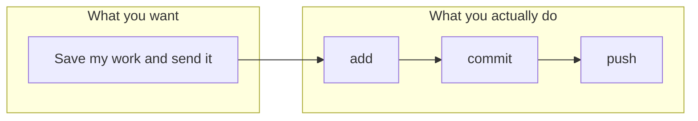

A lot of people find Git frustrating. You’re not dumb. The tool really is harder than it needs to be. This page explains why, in plain words. Our goal is to give you a **clear reference** so the basics don’t have to stay confusing.

The ideas here come from **[“10 things I hate about Git”](https://stevebennett.me/2012/02/24/10-things-i-hate-about-git/)**, a 2012 article by **Steve Bennett**. We’re grateful for that article. It put into words what many people feel. If you want the full, sharp version, read his post. Below we’ve turned his main points into short, simple explanations.

---

## 1. There are a lot of concepts

Git asks you to learn many words at once: working tree, index, commit, branch, remote, push, pull, stash, and more. Other tools get by with fewer ideas. Git doesn’t hide much. So even for “just save my work” you run into a lot of names. **We try to fix that here:** we explain only what you need for the main loop (add, commit, push, pull) and we explain each word when it appears.

---

## 2. The commands are inconsistent

Some things get their own command (like `git pull`). Other things are a flag on another command (like `git checkout -b` to create and switch to a branch). The same verb can do different things depending on what you type after it. So the syntax feels random. **We try to fix that here:** our [Cheat sheet](/cheat-sheet/) and command pages show the form you’ll actually use, with a short “what it does” in human words.

---

## 3. The official docs are not written for beginners

The built-in help often describes things in technical terms (“Update remote refs along with associated objects” instead of “Upload your commits to the server”). That’s fine for experts. For everyone else it’s unhelpful. **We try to fix that here:** every command is described in simple language. No jargon without an explanation.

---

## 4. A simple task needs many steps

To change a few files and share them with a project on GitHub, you don’t do one or two commands. You do: add, commit, maybe switch branch, push, then use the website to open a pull request. Each step is small, but there are a lot of them. Steve Bennett pointed out that in older tools, “make changes and share” could be fewer steps. In Git, the **simple path** is still long.

Here’s a simple picture of that. To “save my work and send it to the server,” you touch several things:

So: one goal, several commands. That’s why we put the **daily loop** (status → add → commit → push / pull) right at the start of our [Workflow](/workflow/) and our [Cheat sheet](/cheat-sheet/). Learn that loop first. The rest can wait.

---

## 5. Power is built for maintainers, but everyone pays the cost

A lot of Git’s design helps people who **merge** lots of contributions and manage many branches. Most users just want to save their work and sync. They still have to deal with the same concepts and commands. So the tool feels like overkill. **We try to fix that here:** we focus on the subset that covers “save, sync, and work on a branch when I need to.” We don’t ask you to learn rebase or reflog to get started.

---

## 6. Some commands can destroy work

Git can rewrite or overwrite history. Commands like `git reset --hard` or force-push can make previous commits very hard to get back. So the “your code is safe once it’s in version control” feeling isn’t always true. **We try to fix that here:** we explain [undo last commit](/how-to/undo-last-commit/) in a safe way, and we don’t teach dangerous options until you need them.

---

## Big thank you to Steve Bennett

**[“10 things I hate about Git”](https://stevebennett.me/2012/02/24/10-things-i-hate-about-git/)** by **Steve Bennett** (2012) is the main inspiration for this page and for our attitude on this site: Git is powerful, but its interface and docs don’t have to stay hostile. His article named the problems clearly. We’re building a **sensible reference** so that the basics are understandable and the most common commands are easy to find.

Thank you, Steve.

For the **origin story** — Linus building Git in about two weeks, the handoff to Junio Hamano, and why neither creator nor long-time maintainer being a native English speaker helps explain the naming and docs — see [Background — how Git got this way](/background/).

---

**Next:** [Background — how Git got this way](/background/) (origin story and why the design is so messy) | [What is Git?](/what-is-git/) | [Cheat sheet](/cheat-sheet/)
