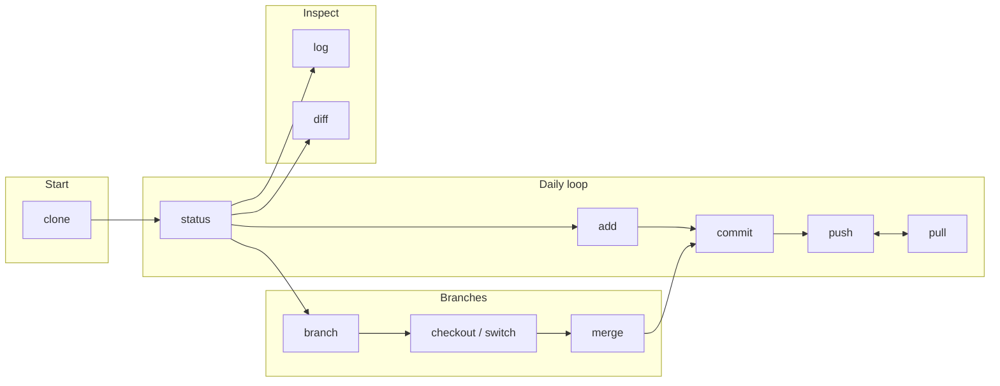

**This page explains the big picture.** It shows which commands you use first and which you use later. The commands you use every day are at the start.

---

**What each box means**

| Box | Commands | When you use it |
|-----|----------|------------------|
| **Start** | clone | You copy a project from the internet to your computer. You do this once per project. |
| **Daily loop** | status, add, commit, push, pull | You use these over and over. You see what changed. You choose what to save. You save. You send or get saves from the internet. |
| **Branches** | branch, switch, merge | You want to try something without changing the main copy. You make a branch. You work there. When you’re done you bring it back into main. |
| **Inspect** | log, diff | You want to see the history of saves or see exactly what changed in a file. |

---

**Where to go next**

- Need a quick list of commands? Use the [Cheat sheet](/cheat-sheet/).
- Need one command explained? Use the sidebar under “Reference: commands”.
- Need to do a specific task? Use the [How-to guides](/how-to/put-project-on-github/).
