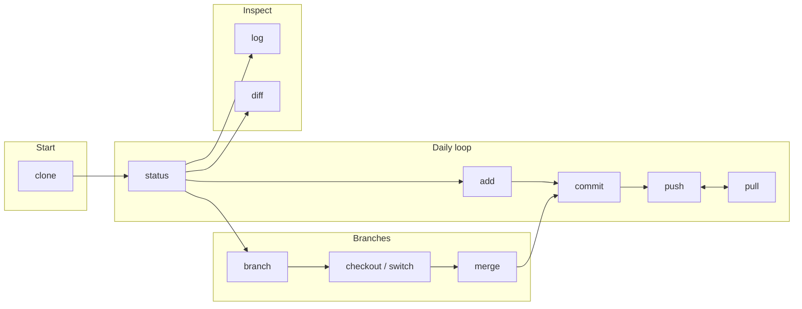

This diagram puts the **most common commands** near the start of the flow. You’ll use these every day; the rest are for specific situations.

## What each block does

| Block | Commands | When |
|-------|----------|------|
| **Start** | `clone` | Get a repo on your machine once. |
| **Daily loop** | `status` → `add` → `commit` → `push` / `pull` | See changes, stage them, save a snapshot, sync with remote. |
| **Branches** | `branch`, `checkout`/`switch`, `merge` | Work on a line of work, switch to it, bring it back. |
| **Inspect** | `log`, `diff` | See history and what changed. |

Go to the [Cheat sheet](/cheat-sheet/) for a full-width reference, or use the sidebar to jump to each command.
